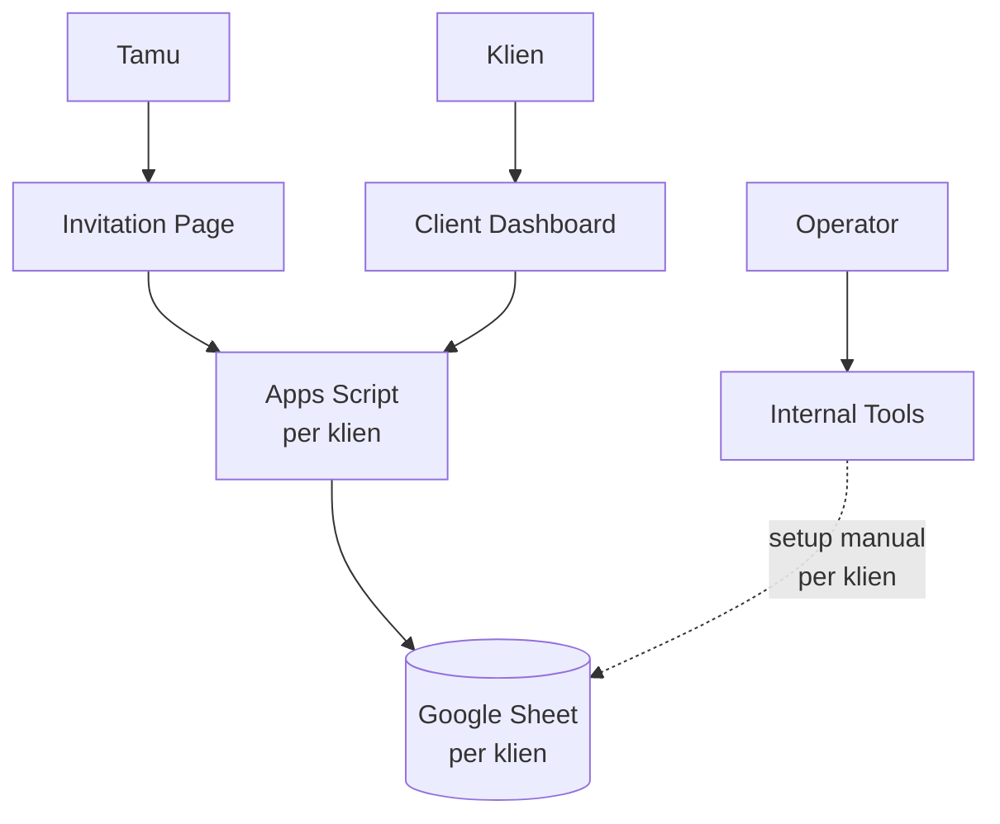
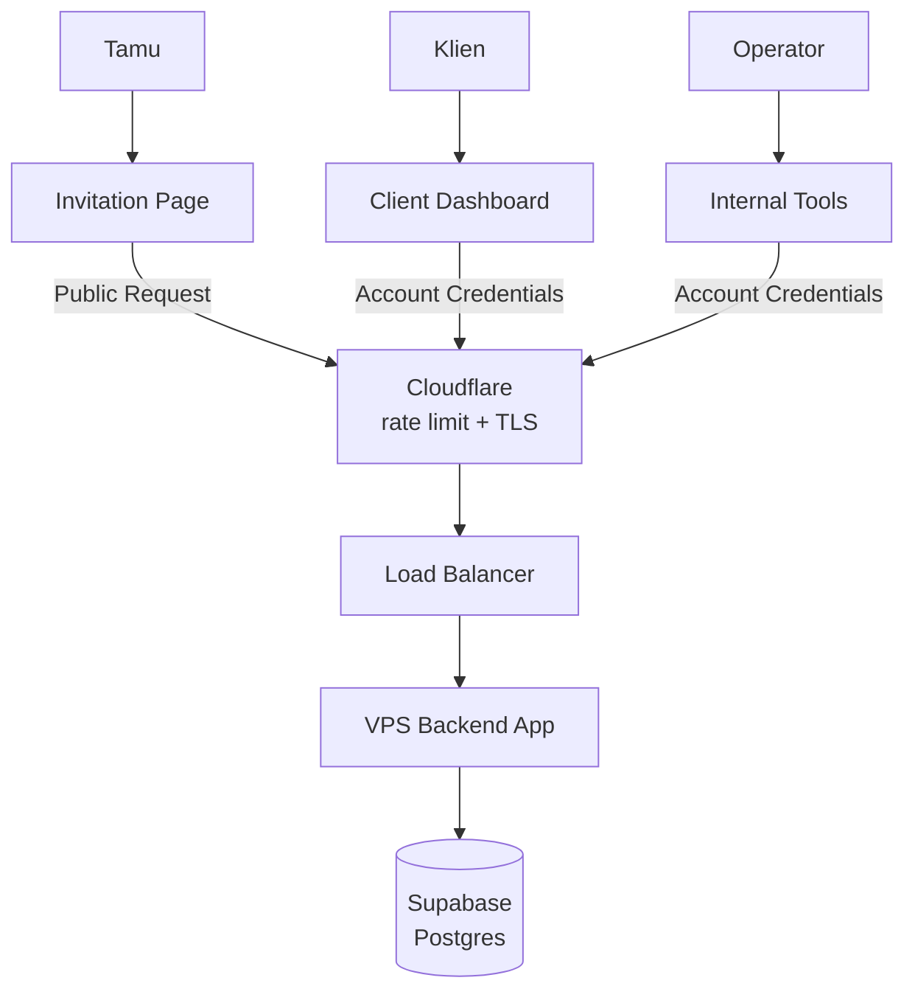

Selama bertahun-tahun, backend Invitato cuma Google Spreadsheet dan Apps Script: gratis, simpel, dan cukup untuk project sampingan. Tapi begitu kliennya tumbuh jadi puluhan sampai ratusan tiap bulan, satu request bisa makan 4 detik, bahkan sampai 45 detik. Di artikel ini saya cerita kenapa dulu kami pakai spreadsheet, kenapa akhirnya pindah, bagaimana arsitektur barunya, dan hasilnya: sekarang p95 cuma 24 ms untuk buka undangan.

## Background: kenapa dulu pakai Google Spreadsheet?

Invitato awalnya cuma project freelance sampingan. Waktu itu sama sekali nggak kepikiran bakal handle puluhan sampai ratusan klien tiap bulannya.

Jadi pilihan paling masuk akal ya Google Spreadsheet. Alasannya:

- **Simpel.** Satu klien, satu sheet, satu Apps Script. Mau lihat data tamu? Tinggal buka sheet-nya.
- **History sudah ada dari sananya.** Version history bawaan Google Sheet bikin tracking issue jadi gampang banget, misalnya "kok RSVP tamu ini hilang?" tinggal cek history.
- **Dan yang paling penting: $0 cost!**

Untuk skala kecil, ini setup yang sangat masuk akal. Nggak ada server yang harus di-maintain, nggak ada database yang harus di-backup.

## Kenapa pindah?

Masalahnya, semakin ke sini performanya semakin jelek. Dari 3 detik, jadi 4 detik, lalu 7 detik, sampai pernah tembus **45 detik** untuk satu request :(

Complain mulai masuk dari klien beneran. Tamu buka undangan, loading lama. Tamu kirim RSVP atau ucapan, muter terus. Dan di sini kami mentok, karena kami nggak bisa upgrade apa-apa. Nggak ada tombol "tambah CPU" di Apps Script. Kami benar-benar cuma bisa mengandalkan apa yang Google kasih, termasuk kuota dan antrean eksekusinya.

Selain performa, ada juga masalah lain yang makin lama makin kerasa:

- **Kontrol akses terbatas.** Apps Script nggak punya mekanisme autentikasi yang proper, jadi kami nggak bisa membatasi siapa boleh baca dan ubah data apa.
- **Onboarding klien manual.** Setiap klien baru, tim kami harus menyiapkan sheet dan Apps Script sendiri, lalu menghubungkannya ke undangan klien satu per satu.

Kira-kira begini arsitektur lamanya:

## Arsitektur baru

Kami ubah jadi **satu backend endpoint dengan satu database utama**. Semua klien sekarang lewat API yang sama, datanya ada di satu Postgres.

Beberapa hal yang menurut saya paling penting dari arsitektur ini:

- **Cloudflare di depan.** Rate limit dan TLS diurus Cloudflare, dan server nggak bisa diakses langsung dari luar.
- **Data sensitif wajib login.** Klien dan tim internal harus login dulu untuk melihat daftar tamu atau mengubah data. Tamu tetap bisa buka undangan, kirim RSVP, dan kirim ucapan seperti biasa.
- **Load balancer dengan blue/green deploy.** Load balancer bisa switch antara dua instance backend app di VPS, jadi deploy tanpa downtime.
- **Postgres dengan PITR.** Pengganti "version history" yang dulu kami suka dari Google Sheet. Kalau ada data yang salah, bisa di-restore ke titik waktu tertentu.

### Drop-in replacement

Yang paling saya syukuri: backend baru ini **drop-in replacement**. Nggak ada perubahan API sama sekali. Nama action-nya sama, bentuk request dan response-nya sama. Tugasnya memang meniru kontrak API yang lama, persis.

Jadi undangan yang sudah live nggak perlu di-deploy ulang dengan logic baru. Alur migrasi per klien cukup:

1. Import data dari `.xlsx` sheet klien ke Postgres.
2. Jalankan parity check, pastikan response API baru sama dengan Apps Script lama.
3. Pindahkan URL endpoint klien ke API baru.

Satu klien cuma butuh **3–5 menit** untuk migrasi.

## Result

Dan hasilnya... performanya benar-benar instan!

Dari dashboard Grafana di atas, dalam 3 jam terakhir di production:

- **Buka undangan p95: 24 ms**
- **Submit (RSVP, ucapan, dll) p95: 46 ms**
- **Success rate: 100%**

Bandingkan dengan sebelumnya yang 1,5–7 detik per request, dan di kondisi terburuk sampai 45 detik. Secara keseluruhan p95 sekarang ada di kisaran 40–130 ms. Ini bukan lagi soal "lebih cepat", tapi rasanya sudah beda kelas.

Bonusnya, sekarang semua log dan metrik masuk ke Grafana. Dulu kalau ada klien complain, kami harus buka execution log Apps Script satu per satu. Sekarang tinggal buka dashboard, filter per action, dan langsung kelihatan mana yang lambat atau error.

Kami juga pasang alert dari Grafana ke Telegram. Kalau error rate naik atau latency melonjak, notifikasinya langsung masuk ke grup tim. Jadi sekarang kami yang tahu duluan ada masalah, bukan klien yang harus complain dulu.

## Cost

Ini satu-satunya trade-off: tadinya **$0**, sekarang kami harus bayar VPS dan database (Supabase Pro).

Tapi menurut saya ini sangat worth it. Klien bayar untuk undangan yang bisa dibuka tamunya dengan cepat, terutama di hari H ketika ratusan tamu buka undangan dan scan QR code di waktu yang hampir bersamaan. Kehilangan satu klien karena undangannya lambat jauh lebih mahal daripada biaya server per bulan.

## Penutup

Google Spreadsheet adalah pilihan yang tepat untuk Invitato di awal, dan saya nggak menyesal pakai itu. Tapi setiap arsitektur ada masa berlakunya. Begitu produknya tumbuh, yang dulu jadi kelebihan (gratis, simpel) berubah jadi batasan yang nggak bisa kami kontrol.

Pelajaran terbesar buat saya: kalau memang harus migrasi, usahakan jadi drop-in replacement. Dengan menjaga kontrak API tetap sama, migrasi ratusan klien bisa dilakukan bertahap, aman, dan cuma butuh beberapa menit per klien.

Semoga bermanfaat :)
