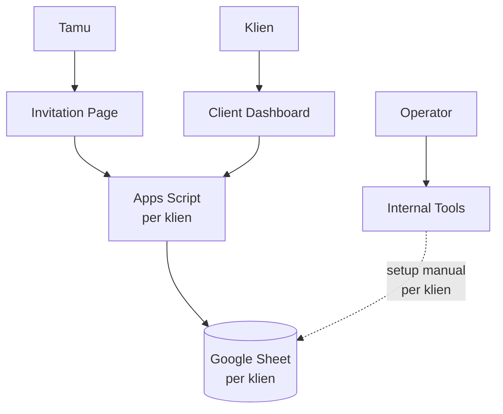
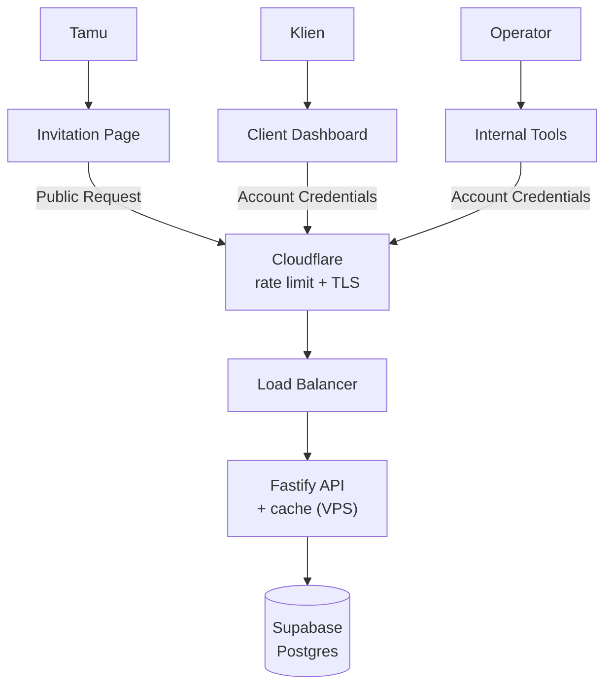

Selama bertahun-tahun, backend Invitato cuma Google Spreadsheet dan Apps Script: gratis, simpel, dan cukup untuk project sampingan. Tapi begitu kliennya tumbuh jadi puluhan sampai ratusan tiap bulan, satu request bisa makan 4 detik, bahkan sampai 45 detik. Di artikel ini saya cerita kenapa dulu kami pakai spreadsheet, kenapa spreadsheet jadi lambat untuk use case kami, bagaimana arsitektur barunya, dan hasilnya: sekarang p95 cuma 24 ms untuk buka undangan.

## Background: kenapa dulu pakai Google Spreadsheet?

Invitato awalnya cuma project freelance sampingan. Waktu itu sama sekali nggak kepikiran bakal handle puluhan sampai ratusan klien tiap bulannya.

Jadi pilihan paling masuk akal ya Google Spreadsheet. Alasannya:

- **Simpel.** Satu klien, satu sheet, satu Apps Script. Mau lihat data tamu? Tinggal buka sheet-nya.
- **History sudah ada dari sananya.** Version history bawaan Google Sheet bikin tracking issue jadi gampang banget, misalnya "kok RSVP tamu ini hilang?" tinggal cek history.
- **Dan yang paling penting: $0 cost!**

Untuk skala kecil, ini setup yang sangat masuk akal. Nggak ada server yang harus di-maintain, nggak ada database yang harus di-backup.

## Kenapa pindah?

Masalahnya, semakin ke sini performanya semakin jelek. Satu request biasa sudah makan 4 detik, di jam sibuk naik jadi 7 detik, sampai pernah tembus **45 detik** :(

Komplain mulai masuk dari klien beneran. Tamu buka undangan, loading lama. Tamu kirim RSVP atau ucapan, muter terus. Dan di sini kami mentok, karena kami nggak bisa upgrade apa-apa. Nggak ada tombol "tambah CPU" di Apps Script. Kami benar-benar cuma bisa mengandalkan apa yang Google kasih, termasuk kuota dan antrean eksekusinya.

Selain performa, ada juga masalah lain yang makin lama makin kerasa:

- **Kontrol akses terbatas.** Autentikasi yang bisa kami pasang di Apps Script terbatas, jadi keamanannya belum semaksimal yang kami mau. Apalagi setiap lapisan keamanan tambahan bikin request yang sudah lambat jadi makin lama.
- **Onboarding klien manual.** Setiap klien baru, tim kami harus menyiapkan sheet dan Apps Script sendiri, lalu menghubungkannya ke undangan klien satu per satu.

### Kenapa Google Sheet lambat untuk use case kami?

Google Sheet sendiri nggak salah. Dia memang nggak didesain untuk jadi database sebuah web app, dan use case Invitato kena hampir semua batasannya:

- **Setiap request mulai dari nol.** Apps Script bukan server yang terus hidup. Setiap request tamu membuka eksekusi baru, dan eksekusi itu sendiri sudah makan waktu sebelum satu baris data pun dibaca.
- **Nggak ada index.** Spreadsheet nggak bisa di-query seperti database. Untuk mencari satu tamu atau mengambil ucapan terbaru, script harus membaca range data lalu menyaringnya sendiri. Semakin banyak tamu dan ucapan, semakin lama.
- **Menulis harus antre.** Supaya dua RSVP yang masuk bersamaan nggak saling menimpa, penulisan ke sheet harus bergiliran. Di hari H, ketika ratusan tamu buka undangan dan kirim ucapan di waktu yang hampir sama, antrean ini yang bikin request bisa sampai puluhan detik.
- **Kuota eksekusi dari Google.** Jumlah eksekusi yang bisa jalan bersamaan dibatasi, dan kami nggak punya kontrol apa pun untuk menaikkannya.

Kira-kira begini arsitektur lamanya:

## Arsitektur baru

Kami ubah jadi **satu backend endpoint dengan satu database utama**. Semua klien sekarang lewat API yang sama: backend-nya [Fastify](https://fastify.dev) yang jalan di VPS, dan datanya ada di satu Postgres di Supabase.

Beberapa hal yang menurut saya paling penting dari arsitektur ini:

- **Fastify + cache.** Backend-nya proses Node.js yang selalu hidup, jadi nggak ada lagi "mulai dari nol" di setiap request. Data yang paling sering dibaca, seperti isi undangan, di-cache, jadi kebanyakan request buka undangan bahkan nggak perlu menyentuh database.
- **Cloudflare di depan.** Rate limit dan TLS diurus Cloudflare, dan server nggak bisa diakses langsung dari luar.
- **Data sensitif wajib login.** Klien dan tim internal harus login dulu untuk melihat daftar tamu atau mengubah data. Tamu tetap bisa buka undangan, kirim RSVP, dan kirim ucapan seperti biasa.
- **Load balancer dengan blue/green deploy.** Load balancer bisa switch antara dua instance backend app di VPS, jadi deploy tanpa downtime.
- **Postgres dengan PITR.** Pengganti "version history" yang dulu kami suka dari Google Sheet. Kalau ada data yang salah, bisa di-restore ke titik waktu tertentu.

### Drop-in replacement

Yang paling saya syukuri: backend baru ini **drop-in replacement**. Nggak ada perubahan API sama sekali. Nama action-nya sama, bentuk request dan response-nya sama. Tugasnya memang meniru kontrak API yang lama, persis.

Jadi undangan yang sudah live nggak perlu di-deploy ulang dengan logic baru. Untuk migrasinya, kami bikin tools internal khusus. Alurnya per klien:

1. Import data dari `.xlsx` sheet klien ke Postgres.
2. Tools-nya memanggil API lama dan API baru dengan request yang sama, lalu membandingkan response keduanya.
3. Kalau hasilnya sudah identik, tim tinggal klik **accept**, dan endpoint klien pindah ke API baru.

Satu klien cuma butuh **3–5 menit** untuk migrasi. Karena ada langkah perbandingan ini, kami yakin tamu nggak akan melihat perbedaan apa pun, kecuali undangannya sekarang jauh lebih cepat.

## Dikerjakan full dengan AI agent

Satu hal yang menurut saya paling menarik: seluruh backend baru ini dikerjakan **full oleh AI agent**. Proses pengerjaannya cuma butuh **2 hari**, dan itu sudah termasuk testing dengan **100% code coverage**.

Tiga skill yang paling membantu:

- **`/grill-me-with-docs`**: sebelum menulis kode, agent "menginterogasi" saya soal rencana migrasinya sampai semua keputusan jelas dan terdokumentasi.
- **`/goal`**: menetapkan target akhir yang jelas, supaya agent terus bekerja sampai target itu benar-benar tercapai.
- **`/code-review`**: setiap perubahan di-review untuk mencari bug sebelum di-merge.

Peran saya lebih banyak di menentukan arah, menjawab pertanyaan agent, dan memastikan hasilnya benar. Persis seperti yang saya tulis di [Jadi Software Engineer: 2018 vs Sekarang di Era Agentic AI](/blog/software-engineer-2018-vs-era-ai/).

## Result

Dan hasilnya... performanya benar-benar instan!

Dari dashboard Grafana di atas, dalam 3 jam terakhir di production:

- **Buka undangan p95: 24 ms**
- **Submit (RSVP, ucapan, dll) p95: 46 ms**
- **Success rate: 100%**

Bandingkan dengan sebelumnya: request biasa 4 detik, di jam sibuk 7 detik, dan di kondisi terburuk sampai 45 detik. Secara keseluruhan p95 sekarang ada di kisaran 40–130 ms. Ini bukan lagi soal "lebih cepat", tapi rasanya sudah beda kelas.

### Bonus: batch update akhirnya bisa dirilis

Ada satu fitur yang sebenarnya sudah lama kami mau, tapi nggak pernah kami rilis: **batch update**, misalnya mengubah status atau data 100–200 tamu sekaligus. Dengan Google Sheet, fitur ini mimpi buruk. Satu batch operation butuh **10–15 detik**, terlalu lama untuk dipakai klien di dashboard.

Dengan backend baru, batch update untuk 100–200 tamu cukup **sekitar 1 detik**. Jadi sekalian migrasi, fitur ini akhirnya kami rilis.

### Monitoring

Sekarang semua log dan metrik masuk ke Grafana. Dulu kalau ada klien komplain, kami harus buka execution log Apps Script satu per satu. Sekarang tinggal buka dashboard, filter per action, dan langsung kelihatan mana yang lambat atau error.

Kami juga pasang alert dari Grafana ke Telegram. Kalau error rate naik atau latency melonjak, notifikasinya langsung masuk ke grup tim. Jadi sekarang kami yang tahu duluan ada masalah, bukan klien yang harus komplain dulu.

## Cost

Ini trade-off terbesarnya: tadinya **$0**, sekarang kami harus bayar VPS dan database (Supabase Pro). Selain itu, sekarang ada server yang harus kami rawat sendiri, sesuatu yang dulu sepenuhnya diurus Google.

Tapi menurut saya ini sangat worth it. Klien bayar untuk undangan yang bisa dibuka tamunya dengan cepat, terutama di hari H ketika ratusan tamu buka undangan dan scan QR code di waktu yang hampir bersamaan. Kehilangan satu klien karena undangannya lambat jauh lebih mahal daripada biaya server per bulan.

## Penutup

Google Spreadsheet adalah pilihan yang tepat untuk Invitato di awal, dan saya nggak menyesal pakai itu. Tapi setiap arsitektur ada masa berlakunya. Begitu produknya tumbuh, yang dulu jadi kelebihan (gratis, simpel) berubah jadi batasan yang nggak bisa kami kontrol.

Pelajaran terbesar buat saya: kalau memang harus migrasi, usahakan jadi drop-in replacement. Dengan menjaga kontrak API tetap sama, migrasi ratusan klien bisa dilakukan bertahap, aman, dan cuma butuh beberapa menit per klien.

Semoga bermanfaat :)
